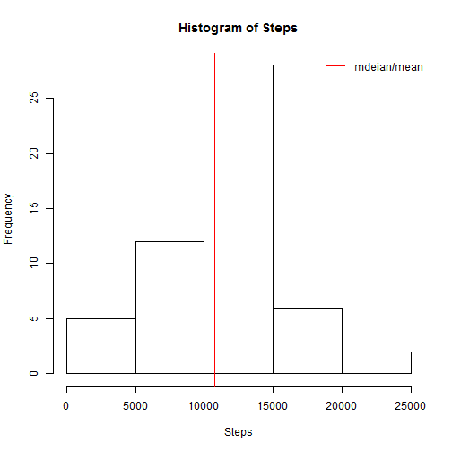
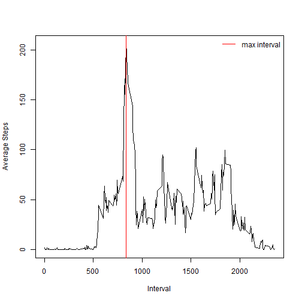
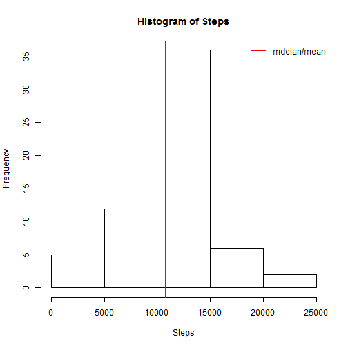
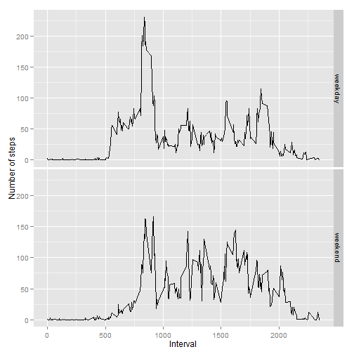

# Reproducible Research: Peer Assessment 1


## Loading and preprocessing the data
First we check if the data file is present in the working directory. If not, we 
try to extract if from the archive.

```r
if (file.exists("activity.csv") == FALSE) {
    unzip("activity.zip")
}
```


Now we load the data from the csv file and check the structure.

```r
data <- read.csv(file = "activity.csv", header = TRUE)
str(data)
```

```
## 'data.frame':	17568 obs. of  3 variables:
##  $ steps   : int  NA NA NA NA NA NA NA NA NA NA ...
##  $ date    : Factor w/ 61 levels "2012-10-01","2012-10-02",..: 1 1 1 1 1 1 1 1 1 1 ...
##  $ interval: int  0 5 10 15 20 25 30 35 40 45 ...
```


We notice that there is incomplete data, so we will extract the subset with 
complete observations.


```r
clean.data <- data[complete.cases(data), ]
str(clean.data)
```

```
## 'data.frame':	15264 obs. of  3 variables:
##  $ steps   : int  0 0 0 0 0 0 0 0 0 0 ...
##  $ date    : Factor w/ 61 levels "2012-10-01","2012-10-02",..: 2 2 2 2 2 2 2 2 2 2 ...
##  $ interval: int  0 5 10 15 20 25 30 35 40 45 ...
```


## What is mean total number of steps taken per day?

To do this, we aggregate the steps based on the date.


```r
aggregated <- with(clean.data, aggregate(steps, by = list(date), FUN = sum))
names(aggregated) <- c("Date", "Steps")
```


Here is a histogram of the total number of steps per day. The mean and median
are also shown on the histogram, but because their values are very close
compared to the scale, they will overwrite eachother.


```r
with(aggregated, hist(Steps))
with(aggregated, abline(v = mean(Steps), col = "red"))
with(aggregated, abline(v = median(Steps), col = "red"))
legend("topright", "mdeian/mean", lty = 1, col = "red", bty = "n")
```

 

```r

mean(aggregated$Steps)
```

```
## [1] 10766
```

```r
median(aggregated$Steps)
```

```
## [1] 10765
```


## What is the average daily activity pattern?

First we need to prepare the data by aggregating the steps by inteval using mean
as function.


```r
agg.interval <- with(clean.data, aggregate(steps, by = list(interval), FUN = mean))
names(agg.interval) <- c("Interval", "AvgSteps")
str(agg.interval)
```

```
## 'data.frame':	288 obs. of  2 variables:
##  $ Interval: int  0 5 10 15 20 25 30 35 40 45 ...
##  $ AvgSteps: num  1.717 0.3396 0.1321 0.1509 0.0755 ...
```


We also need to calculate where the maximum value of the average appears.


```r
max.index <- grep(max(agg.interval$AvgSteps), agg.interval$AvgSteps)
```


The maximum average is:

```r
agg.interval$AvgSteps[max.index]
```

```
## [1] 206.2
```


... and it appears for the interval:

```r
agg.interval$Interval[max.index]
```

```
## [1] 835
```


Now we can plot the averages for each interval and show the interval with the 
maximum average.


```r
with(agg.interval, plot(Interval, AvgSteps, type = "l", ylab = "Average Steps"))
abline(v = agg.interval$Interval[max.index], col = "red")
legend("topright", "max interval", lty = 1, col = "red", bty = "n")
```

 


## Inputting missing values

There are incomplete observations and we will calculate their number now:

```r
length(data[complete.cases(data) == FALSE, ]$interval)
```

```
## [1] 2304
```


Because we know the number of steps depends on the time of the day, we will
estimate the number of steps for the missing observasions to the mean of the 
steps for the particular interval on all the days. Because the averages are not
integer values, we will round them.

To do this, we first match the missing intervals to the indexes of the 
`agg.interval` where we store the averages for each interval. Then we fill the
values from `data` with the averages. 

```r
interval.indexes <- match(data[complete.cases(data) == FALSE, ]$interval, agg.interval$Interval)
completed.data <- data
completed.data[complete.cases(data) == FALSE, ]$steps = round(agg.interval[interval.indexes, 
    ]$AvgSteps)
str(completed.data)
```

```
## 'data.frame':	17568 obs. of  3 variables:
##  $ steps   : num  2 0 0 0 0 2 1 1 0 1 ...
##  $ date    : Factor w/ 61 levels "2012-10-01","2012-10-02",..: 1 1 1 1 1 1 1 1 1 1 ...
##  $ interval: int  0 5 10 15 20 25 30 35 40 45 ...
```


Now we will display the histogram and the mean/median values for the new data 
set (`completed.data`). First we calculate the aggregate:


```r
agg.completed <- with(completed.data, aggregate(steps, by = list(date), FUN = sum))
names(agg.completed) <- c("Date", "Steps")
```


```r
with(agg.completed, hist(Steps))
with(agg.completed, abline(v = mean(Steps), col = "red"))
with(agg.completed, abline(v = median(Steps), col = "red"))
legend("topright", "mdeian/mean", lty = 1, col = "red", bty = "n")
```

 

```r

mean(agg.completed$Steps)
```

```
## [1] 10766
```

```r
median(agg.completed$Steps)
```

```
## [1] 10762
```


We can see that by estimating the missing values with the mean of each interval,
the mean was not affected and the median has been only slightly affected, by a
value that can be ignored compared to the scale (around 0.03%).

## Are there differences in activity patterns between weekdays and weekends?

First we add a new factor to the data set indicating if the date is weekday or
weekend.


```r
weekdays.text <- weekdays(strptime(as.character(data$date), format = "%Y-%m-%d"))
is.weekend <- weekdays.text %in% c("Saturday", "Sunday")
completed.data$weekpart <- factor(ifelse(is.weekend, "weekend", "weekday"))
str(completed.data)
```

```
## 'data.frame':	17568 obs. of  4 variables:
##  $ steps   : num  2 0 0 0 0 2 1 1 0 1 ...
##  $ date    : Factor w/ 61 levels "2012-10-01","2012-10-02",..: 1 1 1 1 1 1 1 1 1 1 ...
##  $ interval: int  0 5 10 15 20 25 30 35 40 45 ...
##  $ weekpart: Factor w/ 2 levels "weekday","weekend": 1 1 1 1 1 1 1 1 1 1 ...
```


We aggregate the data by intervals and weekpart.


```r
agg.weekdays <- with(completed.data, aggregate(steps, by = list(interval, weekpart), 
    FUN = mean))
names(agg.weekdays) <- c("Interval", "WeekPart", "Steps")
str(agg.weekdays)
```

```
## 'data.frame':	576 obs. of  3 variables:
##  $ Interval: int  0 5 10 15 20 25 30 35 40 45 ...
##  $ WeekPart: Factor w/ 2 levels "weekday","weekend": 1 1 1 1 1 1 1 1 1 1 ...
##  $ Steps   : num  2.2889 0.4 0.1556 0.1778 0.0889 ...
```


Now we are going to plot the average number of steps on each interval with two
panels for weekdays and weekends, using ggplot2 (because it handles better plots
with facets/panels).


```r
library(ggplot2)
qplot(Interval, Steps, data = agg.weekdays, facets = WeekPart ~ ., geom = "line", 
    ylab = "Number of steps")
```

 

